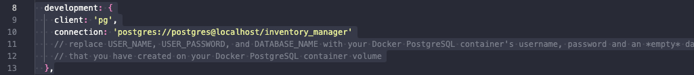
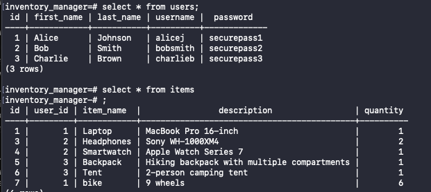
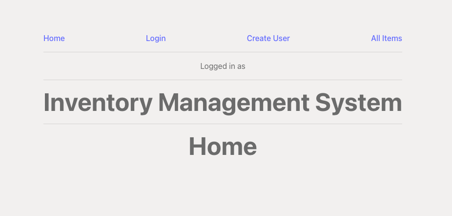
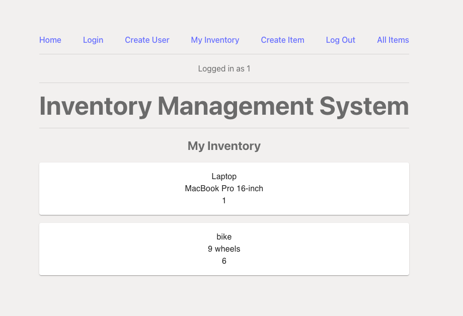
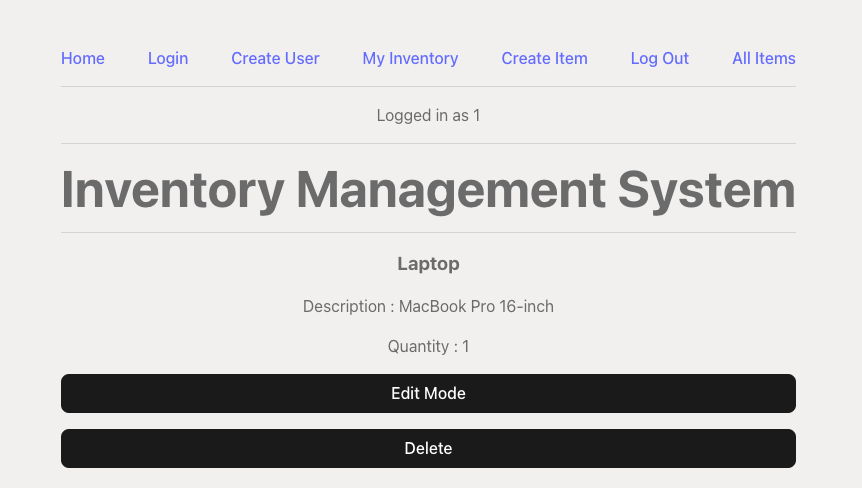
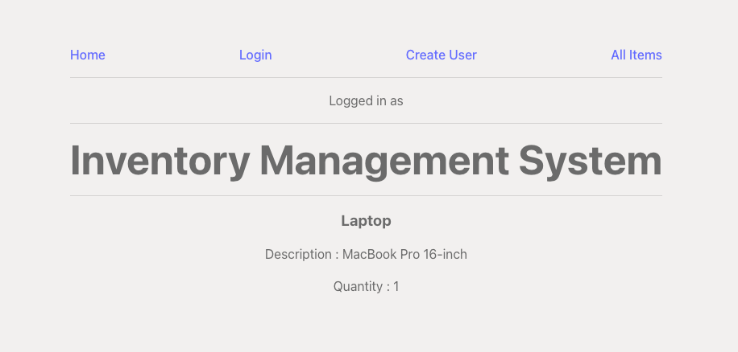

# zprefix

# Setup 
1. modify this section in server/knexfile.js to connect to your desired database 

2. if using your existing database, make sure the column name are as shown
 

3. if not using existing database `cd server` `npx knex migrate:latest` `npx knex seed:run` for a sample database

4. To spin up the app do `cd server` `npm i` `npm run dev` then in a new terminal `cd client` `npm i` `npm run dev` 

5. Go to localhost:3000 and the app should be running there

# App Walkthrough 

1. When loading the page you'll be welcomed with 

2. Certain features are hidden unless you're logged in such as the ability to create/edit/delete items 

3. Clicking on an item will give you the ability to view its details as well as the ability to edit and delete if the item belongs to your account

4. Whereas if you're logged out or if you're not the item owner, the ability doesn't exist

# API Endpoint 

- Get
    - /items/:id                get specific item
    - /items                    get all items
    - /my-inventory/:userid     get all item belonging to specific user
- Post
    - /users-create             create user account
    - /items-create             create item 
    - /users                    used for login functionality

- Delete 
    - /items/:id                delete specific item

- Patch
    - /items/:id                modify specific item 